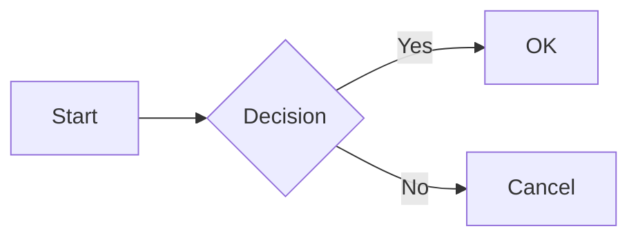
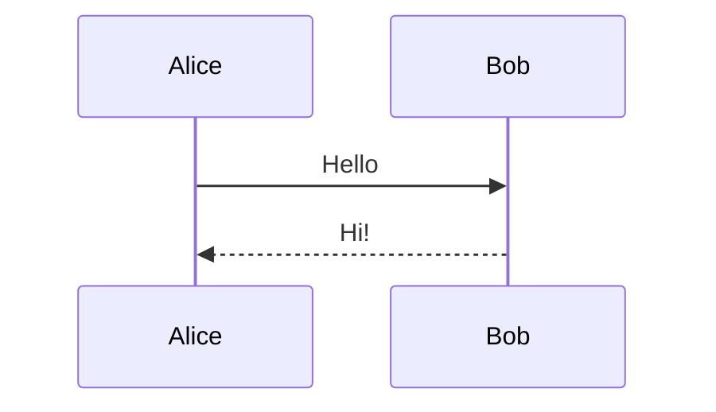
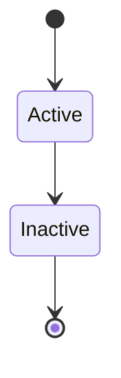
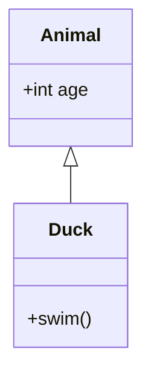
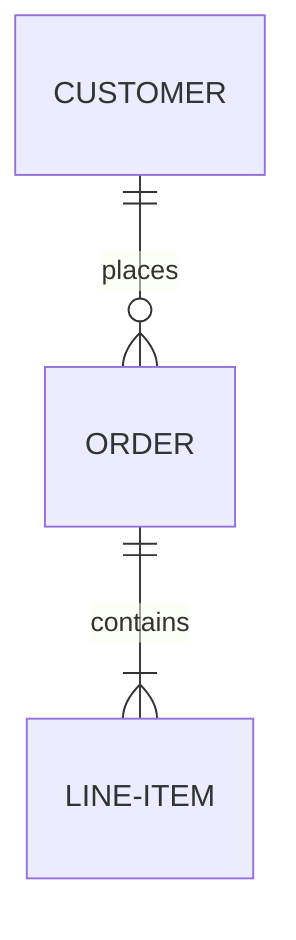

# Best Practices

Best practices for writing and maintaining OneTool documentation with MkDocs Material.

## Configuration Strategy

### Priority Order

When customizing Material for MkDocs, prefer this order (minimal maintenance):

1. **mkdocs.yml theme configuration** - Use built-in options first
2. **CSS variables** - Override Material's CSS custom properties
3. **Attribute lists** - Add classes directly in Markdown `{ .class }`
4. **Template overrides** - Only for structural changes that can't be done otherwise
5. **Custom CSS rules** - Last resort for styling

### Why This Order?

- **mkdocs.yml** - Survives theme updates, well-documented
- **CSS variables** - Theme-aware, minimal code
- **Attribute lists** - Content stays in Markdown, not templates
- **Templates** - Fragile, may break on theme updates
- **Custom CSS** - Requires understanding Material internals

## Typography

### System Fonts (Recommended)

Use system fonts for best performance and native feel.

**Configuration:**

```yaml
theme:
  font: false  # Disable Google Fonts
```

## Logo with Theme Support

### Single SVG Approach

Use CSS `mask-image` to color a single SVG based on theme:

```css
.logo-element {
  background-color: var(--brand-primary);
  -webkit-mask: url("logo.svg") no-repeat center / contain;
  mask: url("logo.svg") no-repeat center / contain;
}
```

**SVG requirements:**
- Fill color in the SVG doesn't matter
- Use solid shapes (transparency becomes cutout)
- Avoid complex gradients

## Bento Grid Layout

### Pure Markdown Approach

Use CSS utilities with Markdown attribute lists for bento layouts.

**CSS utilities to add:**

```css
.bento {
  display: grid;
  grid-template-columns: repeat(4, 1fr);
  gap: 1rem;
}

.span-2 { grid-column: span 2; }
.span-3 { grid-column: span 3; }
.span-4 { grid-column: span 4; }
.tall { grid-row: span 2; }

/* Responsive breakpoints */
@media (max-width: 900px) {
  .bento { grid-template-columns: repeat(2, 1fr); }
  .span-2, .span-3, .span-4 { grid-column: span 2; }
}

@media (max-width: 600px) {
  .bento { grid-template-columns: 1fr; }
  .span-2, .span-3, .span-4 { grid-column: span 1; }
}
```

**Usage in Markdown:**

```markdown
<div class="bento" markdown>

<div class="card span-2" markdown>
### Wide Card
Content here.
</div>

<div class="card" markdown>
### Normal Card
Content here.
</div>

</div>
```

**Key points:**
- `markdown` attribute allows Markdown inside HTML
- `{ .class }` syntax requires `attr_list` extension
- No template overrides needed

## Material for MkDocs Feature Reference

### Required Extensions

Ensure these are in `mkdocs.yml`:

```yaml
markdown_extensions:
  - abbr
  - admonition
  - attr_list
  - def_list
  - footnotes
  - md_in_html
  - tables
  - toc:
      permalink: true
  - pymdownx.betterem
  - pymdownx.caret
  - pymdownx.critic
  - pymdownx.details
  - pymdownx.emoji:
      emoji_index: !!python/name:material.extensions.emoji.twemoji
      emoji_generator: !!python/name:material.extensions.emoji.to_svg
  - pymdownx.highlight:
      anchor_linenums: true
  - pymdownx.inlinehilite
  - pymdownx.keys
  - pymdownx.mark
  - pymdownx.smartsymbols
  - pymdownx.snippets
  - pymdownx.superfences:
      custom_fences:
        - name: mermaid
          class: mermaid
          format: !!python/name:pymdownx.superfences.fence_code_format
  - pymdownx.tabbed:
      alternate_style: true
  - pymdownx.tasklist:
      custom_checkbox: true
  - pymdownx.tilde
```

### Admonitions (Callouts)

**Basic:**

```markdown
!!! note
    Content here. Indent with 4 spaces.
```

**With custom title:**

```markdown
!!! note "Custom Title"
    Content here.
```

**Without title:**

```markdown
!!! note ""
    Just content, no title bar.
```

**Available types:**

| Type | Use for |
|------|---------|
| `note` | General information |
| `abstract` | Summary/TLDR |
| `info` | Informational |
| `tip` | Helpful hints |
| `success` | Positive outcomes |
| `question` | FAQ/help |
| `warning` | Cautions |
| `failure` | What not to do |
| `danger` | Critical warnings |
| `bug` | Known issues |
| `example` | Code examples |
| `quote` | Citations |

**Collapsible (closed):**

```markdown
??? note "Click to expand"
    Hidden content.
```

**Collapsible (open):**

```markdown
???+ note "Click to collapse"
    Visible by default.
```

**Nested:**

```markdown
!!! note "Outer"
    Content.

    !!! tip "Inner"
        Nested content.
```

### Code Blocks

**Basic:**

````markdown
```python
def hello():
    return "world"
```
````

**With title:**

````markdown
```python title="example.py"
code here
```
````

**With line numbers:**

````markdown
```python linenums="1"
code here
```
````

**Starting from specific line:**

````markdown
```python linenums="42"
code here
```
````

**Highlight specific lines:**

````markdown
```python hl_lines="2 3"
line 1
line 2  # highlighted
line 3  # highlighted
```
````

**With annotations:**

````markdown
```python
def hello():
    return "world"  # (1)!
```

1. This annotation explains the line.
````

**Inline code highlighting:**

```markdown
Use `#!python print("hello")` for inline.
```

### Content Tabs

**Basic:**

```markdown
=== "Tab 1"
    Content for tab 1.

=== "Tab 2"
    Content for tab 2.
```

**With code blocks:**

````markdown
=== "Python"
    ```python
    print("Hello")
    ```

=== "JavaScript"
    ```javascript
    console.log("Hello");
    ```
````

**Linked tabs** (sync across page): Enable `content.tabs.link` feature.

### Icons & Emoji

**Material Design Icons:**

```markdown
:material-account-circle:
:material-check:
:material-close:
:material-code-braces:
:material-arrow-right:
```

**Octicons:**

```markdown
:octicons-arrow-right-24:
:octicons-check-16:
:octicons-x-16:
:octicons-repo-16:
```

**FontAwesome:**

```markdown
:fontawesome-brands-github:
:fontawesome-brands-python:
:fontawesome-solid-heart:
```

**Standard emoji:**

```markdown
:smile: :rocket: :warning: :bulb:
```

**With styling:**

```markdown
:material-check:{ .green }
:material-close:{ .red }
```

[Icon search tool](https://squidfunk.github.io/mkdocs-material/reference/icons-emojis/#search)

### Buttons

**Primary:**

```markdown
[Button Text](url){ .md-button .md-button--primary }
```

**Secondary:**

```markdown
[Button Text](url){ .md-button }
```

**With icon:**

```markdown
[Get Started :material-arrow-right:](url){ .md-button }
```

### Tables

**Basic:**

```markdown
| Header 1 | Header 2 |
|----------|----------|
| Cell 1   | Cell 2   |
```

**Alignment:**

```markdown
| Left | Center | Right |
|:-----|:------:|------:|
| a    |   b    |     c |
```

**Sortable tables:** Add tablesort.js (see Material docs).

### Lists

**Task list:**

```markdown
- [x] Completed
- [ ] Incomplete
    - [x] Nested complete
    - [ ] Nested incomplete
```

**Definition list:**

```markdown
Term
:   Definition of the term.

Another term
:   Another definition.
```

**Nested lists:** Indent with 4 spaces.

### Text Formatting

| Syntax | Result |
|--------|--------|
| `==highlight==` | Highlighted text |
| `^^underline^^` | Underlined text |
| `~~strikethrough~~` | Strikethrough |
| `H~2~O` | Subscript (H₂O) |
| `X^2^` | Superscript (X²) |

### Keyboard Keys

```markdown
++ctrl+alt+del++
++cmd+shift+p++
++enter++
++tab++
++arrow-up++
```

### Tooltips

**On abbreviations (automatic):**

```markdown
The HTML spec is maintained by W3C.

*[HTML]: Hyper Text Markup Language
*[W3C]: World Wide Web Consortium
```

**On any element:**

```markdown
:material-information-outline:{ title="Tooltip text" }
```

### Footnotes

**Reference:**

```markdown
Here is a statement[^1] with a footnote.
```

**Definition:**

```markdown
[^1]: This is the footnote content.
```

**Multi-line:**

```markdown
[^2]:
    Long footnote with multiple paragraphs.

    Can include code blocks too.
```

### Diagrams (Mermaid)

**Flowchart:**

````markdown

````

**Sequence:**

````markdown

````

**State:**

````markdown

````

**Class:**

````markdown

````

**ER Diagram:**

````markdown

````

### Grids (Built-in)

**Card grid (equal width):**

```markdown
<div class="grid cards" markdown>

- :material-clock-fast: **Title**

  
  Description text.

  [:octicons-arrow-right-24: Link](#)

- :material-code-braces: **Another**

  
  More text.

</div>
```

**Generic grid (2 columns):**

```markdown
<div class="grid" markdown>

!!! note "Left"
    Content.

!!! tip "Right"
    Content.

</div>
```

### Images

**Basic:**

```markdown

```

**With sizing:**

```markdown
{ width="300" }
```

**Alignment:**

```markdown
{ align=left }
{ align=right }
```

**Light/dark variants:**

```markdown


```

**Lazy loading:**

```markdown
{ loading=lazy }
```

**Caption (with figure):**

```markdown
<figure markdown="span">
  { width="300" }
  <figcaption>Caption text</figcaption>
</figure>
```

### Critic Markup (Track Changes)

```markdown
{--deleted text--}
{++added text++}
{~~old~>new~~}
{==highlighted==}
{>>inline comment<<}
```

**Block highlight:**

```markdown
{==

Entire paragraph highlighted.

==}
```

### Attribute Lists

Add classes, IDs, or attributes to any element:

```markdown
# Heading { #custom-id }

Paragraph with class.
{ .custom-class }

[Link](url){ target="_blank" }

{ width="200" loading="lazy" }
```

### Page Metadata (Front Matter)

```yaml
title: Page Title
description: Meta description for SEO
hide:
  - navigation
  - toc
  - footer
icon: material/home
status: new  # or: deprecated
```
