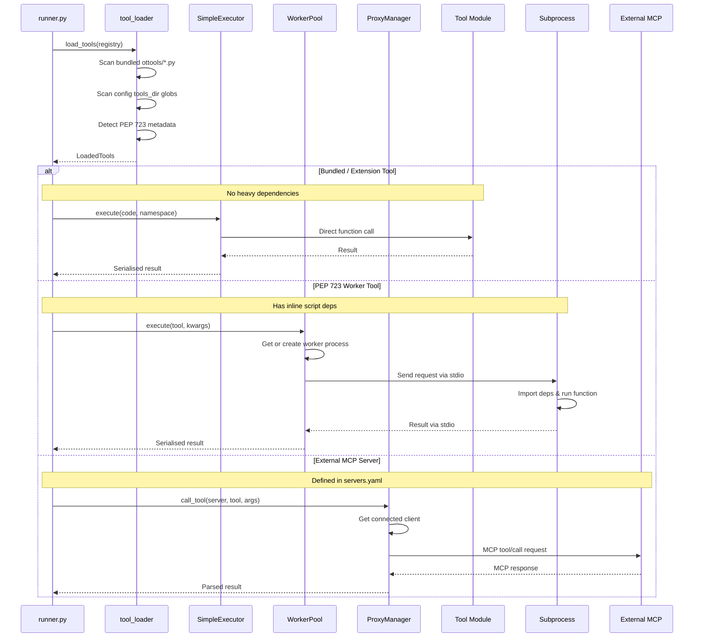

# Execution Routing

Tools are routed to one of three executors based on their type.

## Executor Types

| Executor | When | Example |
|----------|------|---------|
| **SimpleExecutor** | Bundled/extension tools with no heavy deps | `brave.search`, `file.read` |
| **WorkerPool** | Tools with PEP 723 inline script metadata | `db.query` (needs sqlalchemy) |
| **ProxyManager** | External MCP servers defined in config | `github.get_file_contents` |

## Sequence Diagram

## Key Files

| File | Role |
|------|------|
| `src/ot/executor/tool_loader.py` | Discovers tools, detects PEP 723, builds LoadedTools |
| `src/ot/executor/simple.py` | In-process execution (fast, no isolation) |
| `src/ot/executor/worker_pool.py` | Subprocess pool for isolated execution |
| `src/ot/proxy/manager.py` | Routes calls to external MCP servers |
| `src/ot/executor/pack_proxy.py` | PackProxy, McpProxyPack, WorkerPackProxy |
