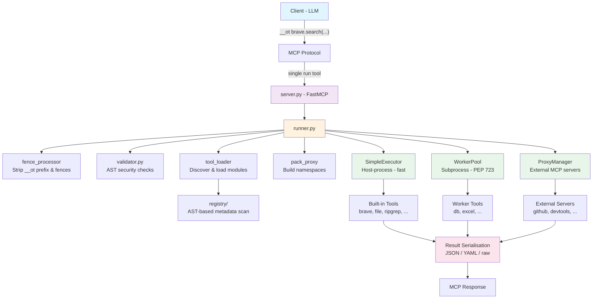

# Architecture Overview

OneTool is a single MCP server that exposes 100+ tools through one `run` endpoint. Instead of LLMs reading verbose tool schemas (~3K-30K tokens per server), agents write Python code:

```python
__ot brave.search(query="react docs")
```

This delivers ~96% token savings and eliminates context rot.

## Architecture Diagram



## Project Structure

```
src/
  ot/                        # Core framework
    server.py                #   FastMCP server, single "run" tool
    tools.py                 #   Inter-tool API (call_tool, get_pack)
    meta.py                  #   Path resolution (resolve_ot_path)
    decorators.py            #   @tool decorator
    config/                  #   YAML config loading & Pydantic models
    executor/                #   Python code execution engine
      runner.py              #     Unified command execution
      validator.py           #     AST security validation
      tool_loader.py         #     Tool discovery & loading
      pack_proxy.py          #     Namespace building & proxies
      param_resolver.py      #     Keyword argument resolution
      fence_processor.py     #     Strip prefixes & code fences
      simple.py              #     In-process executor
      worker_pool.py         #     Subprocess executor
      linter.py              #     Code linting
    registry/                #   Tool metadata scanning (AST-based)
    shortcuts/               #   Aliases & snippets
    proxy/                   #   External MCP server proxy
    logging/                 #   Structured logging (LogSpan, LogEntry)
    stats/                   #   Execution statistics (JSONL)
    utils/                   #   Format, sanitise, validation helpers

  ottools/                  # Built-in tool packs (15+ packs, 100+ tools)
    brave_search.py          #   Web/news/image search
    context7.py              #   Library documentation
    convert.py               #   Document conversion (PDF, DOCX, PPTX)
    db.py                    #   Database operations (SQLite, PostgreSQL, etc.)
    diagram.py               #   Mermaid/PlantUML diagrams
    excel.py                 #   Excel file handling
    file.py                  #   Filesystem operations
    grounding_search.py      #   Google Grounding
    mem.py                   #   Persistent vector memory
    ripgrep.py               #   Fast regex search
    transform.py             #   LLM-powered transforms
    web_fetch.py             #   Web page fetching

  onetool/                   # MCP server CLI (onetool.cli:cli)
  bench/                     # Benchmark harness CLI (bench.cli:cli)
```

## Deep Dives

| Document | Topic |
|----------|-------|
| [Core Concepts](core-concepts.md) | Packs, aliases, snippets, namespaces |
| [Request Pipeline](request-pipeline.md) | End-to-end request processing (sequence diagram) |
| [Execution Routing](execution-routing.md) | How tools are dispatched to executors (sequence diagram) |
| [Registry System](registry-system.md) | AST-based tool discovery (sequence diagram) |
| [Proxy Flow](proxy-flow.md) | External MCP server communication (sequence diagram) |
| [Security Model](security-model.md) | Four-layer defence, validation, sanitisation |
| [Configuration](configuration.md) | Config files, resolution, output formatting |
