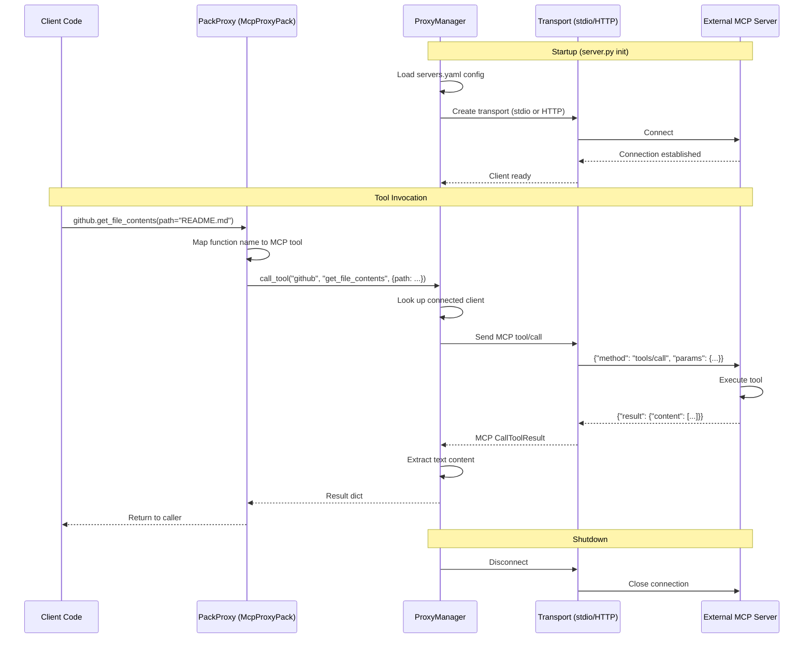

# Proxy Flow - External MCP Servers

OneTool can proxy calls to external MCP servers defined in `servers.yaml`,
exposing them as regular pack namespaces (e.g., `github.get_file_contents()`).

## Connection Types

| Transport | Config | Example |
|-----------|--------|---------|
| **stdio** | `command` + `args` | `npx @anthropic-ai/github-mcp-server` |
| **HTTP** | `url` | `http://localhost:8080` |

## Sequence Diagram

## Key Files

| File | Role |
|------|------|
| `src/ot/proxy/manager.py` | Connection management and tool routing |
| `src/ot/executor/pack_proxy.py` | McpProxyPack wraps proxy as dot-notation namespace |
| `.onetool/config/servers.yaml` | External server definitions |
