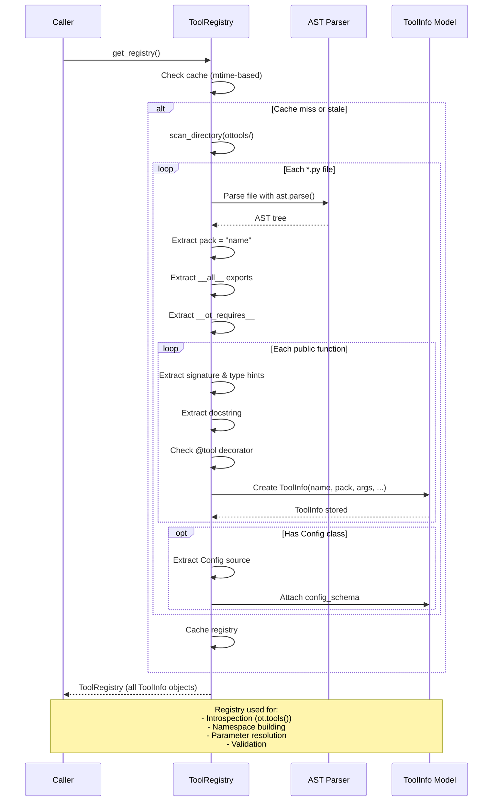

# Registry System

The registry discovers tools without importing them by scanning Python files
with AST. For each file it extracts:

- Pack name and public functions
- Function signatures, docstrings, type hints
- `@tool` decorator metadata
- Config class definitions
- `__ot_requires__` dependency declarations

The registry is cached and invalidated by file mtime changes.

## Sequence Diagram

## ToolInfo Structure

Each discovered tool is stored as a `ToolInfo` with:

| Field | Description |
|-------|-------------|
| `name` | Full qualified name (e.g., `brave.search`) |
| `pack` | Pack namespace (e.g., `brave`) |
| `module` | Python module path |
| `signature` | Full function signature |
| `description` | From docstring |
| `args` | List of ArgInfo (name, type, default, description) |
| `config_schema` | Config class source (if present) |
| `requires` | `__ot_requires__` declarations |

## Key Files

| File | Role |
|------|------|
| `src/ot/registry/registry.py` | Scanner and cache logic |
| `src/ot/registry/models.py` | ToolInfo, ArgInfo data models |
