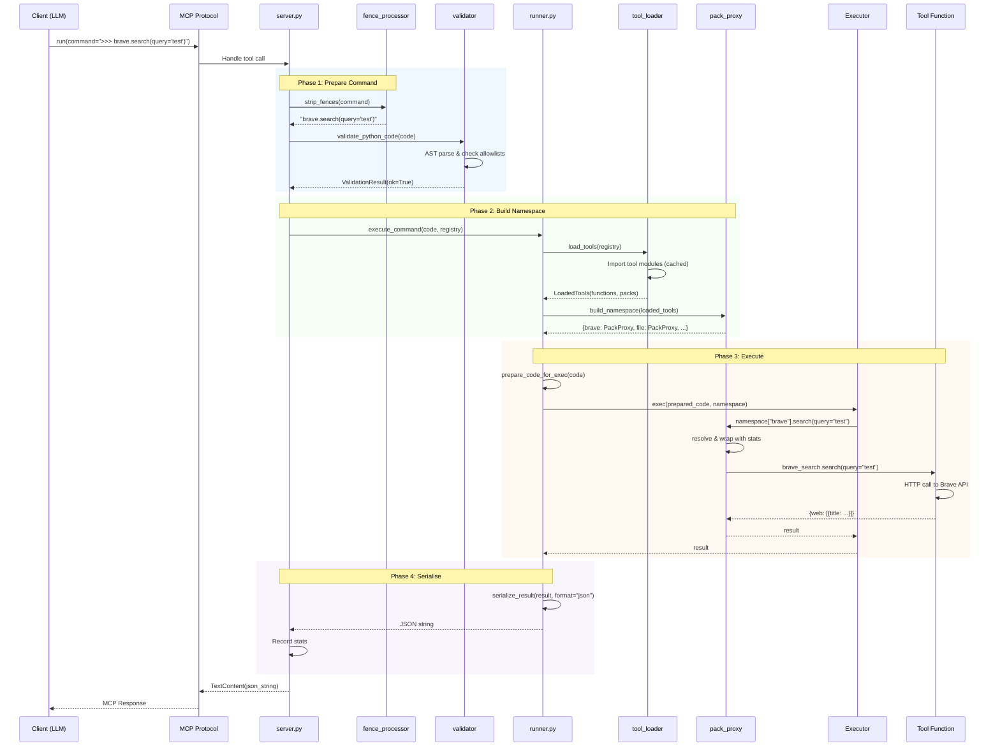

# Request Processing Pipeline

Every call flows through a seven-stage pipeline from client to response.

## Stages

1. **Fence stripping** - Remove trigger prefix (`>>>`, `__run`, legacy `__ot`), markdown fences, backticks
2. **Validation** - AST-based security checks against allowlists
3. **Code preparation** - Parse Python, auto-wrap last expression as return
4. **Namespace building** - Load tool packs as proxy objects
5. **Execution** - Run code in sandboxed namespace via `exec()`
6. **Serialisation** - Convert result to JSON/YAML/raw string
7. **Statistics** - Record execution timing and metadata

## Sequence Diagram

## Key Files

| File | Role |
|------|------|
| `src/ot/server.py` | FastMCP server, `run()` entry point |
| `src/ot/executor/runner.py` | Orchestrates prepare + execute |
| `src/ot/executor/fence_processor.py` | Strips trigger prefix, fences, backticks |
| `src/ot/executor/validator.py` | AST-based security validation |
| `src/ot/executor/pack_proxy.py` | Builds dot-notation namespace |
| `src/ot/utils/format.py` | Result serialisation (JSON/YAML/raw) |
