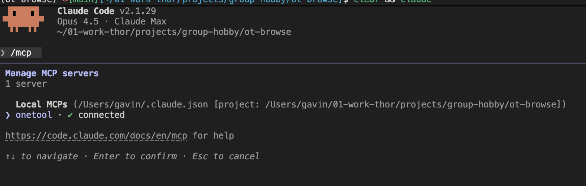

# Quickstart

Get OneTool running in under 2 minutes.

## 1. Install uv

OneTool requires [uv](https://docs.astral.sh/uv/) - a fast Python package manager.

```bash
# macOS/Linux
curl -LsSf https://astral.sh/uv/install.sh | sh

# Windows
powershell -ExecutionPolicy ByPass -c "irm https://astral.sh/uv/install.ps1 | iex"
```

## 2. Install OneTool

```bash
uv tool install onetool-mcp
```

## 3. Initialize

```bash
onetool init -c ~/.onetool
```

An interactive TUI opens. Select the extensions you want (prompts, servers, security rules, diagram config, snippets, worktree config — see `src/onetool/cli.py` for the authoritative list). Press space to toggle, enter to confirm.

This creates `~/.onetool/onetool.yaml` with `include:` entries for your selected extensions.

## 4. Set Up Secrets

Edit `~/.onetool/secrets.yaml` to add your API keys:

```yaml
# Brave Search API
# Get your key at: https://brave.com/search/api/
# BRAVE_API_KEY: "your-brave-api-key"

# OpenAI API (for transform tool with OpenAI models)
# Get your key at: https://platform.openai.com/api-keys
# OPENAI_API_KEY: "sk-..."

# OpenRouter API (for transform tool with multiple providers)
# Get your key at: https://openrouter.ai/keys
# OPENROUTER_API_KEY: "sk-or-..."

# Google Gemini API (for grounding search)
# Get your key at: https://aistudio.google.com/apikey
# GEMINI_API_KEY: "AIza..."

# Context7 API (for library documentation)
# Get your key at: https://context7.com/
# CONTEXT7_API_KEY: "ctx7sk-..."

# Anthropic API
# Get your key at: https://console.anthropic.com/
# ANTHROPIC_API_KEY: "sk-ant-..."

# GitHub token for GitHub MCP server
# Get your token at: https://github.com/settings/tokens
# GITHUB_TOKEN: "ghp_xxxxxxxxxxxxxxxxxxxx"
```

Uncomment and add keys for the tools you want to use.

## 5. Validate

```bash
onetool init validate -c ~/.onetool/onetool.yaml
```

This checks your configuration is correct.

## 6. Connect to Claude Code

```bash
claude mcp add onetool -- onetool --config ~/.onetool/onetool.yaml --secrets ~/.onetool/secrets.yaml
```

Or manually add to `~/.claude/mcp.json`:

```json
{
  "mcpServers": {
    "onetool": {
      "command": "onetool",
      "args": ["--config", "/Users/yourname/.onetool/onetool.yaml", "--secrets", "/Users/yourname/.onetool/secrets.yaml"]
    }
  }
}
```

## 7. Verify Connection

Start Claude Code and run `/mcp`. You should see OneTool listed as a connected MCP server.



## 8. Use It

Try a simple health check:

```
>>> ot.health()
```

Or use a prompt like this to ask the agent to help you use OneTool. Note: the `ubad=` parameter is intentional to demonstrate how OneTool handles errors.

```
Issue each command, one at a time.
Before each command explain what you are doing so it is easy for the new OneTool user to follow what you did and why. Use 🧿 to highlight these explanations.
After each command output ✅ and the results of the call or ❌ and the error or issue. Provide a readable snippet of the results.
Use OneTool ot.help() with info="full" to understand how best to use OneTool tools.
Finally, list all OneTool commands used.

Commands:
>>> ot.health()
>>> ot.help()
>>> ot.help(q="web.fetch", i="full")
>>> web.fetch(ubad="https://onetool.beycom.online/")
>>> web.fetch(u="https://onetool.beycom.online/")
>>> $pkg

```

That's it.

🧿 One MCP for developers - No tool tax, no context rot.
100+ tools including Brave, Google, Context7, Excalidraw, AWS, Version Checker, Excel, File Ops, Database, Playwright, Chrome DevTools and many more.
